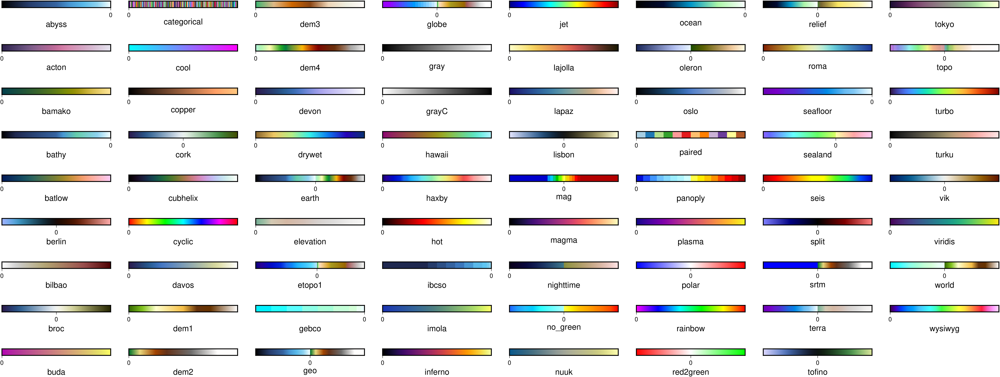

view_cpts: simple script to see all available colormaps in GMT._
-----

Do you want to see the full set of GMT colormaps available in your installation? Here is a simple script that will create a colorbar for each one:

